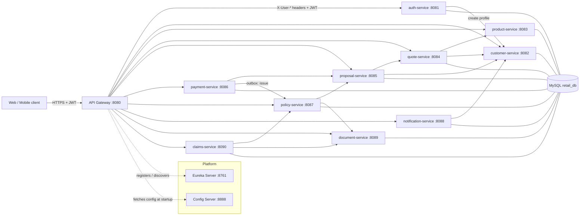

# Insurance E-commerce Platform (Spring Boot Microservices)

A production-style motor-insurance e-commerce platform built incrementally for learning, portfolio and
interview preparation. Customers register, complete KYC, add a vehicle, browse products, get a quote,
submit a proposal, pay, and receive a policy document which they can later renew or claim against.
Every step is its own service.

> **Status: all business services built (Phases 1 - 3H).** Phase 1 = platform (Eureka, Config Server,
> API Gateway). Phase 2 = `common-lib`, `auth-service`, `customer-service`. Phase 3A = `product-service`,
> 3B = `quote-service`, 3C = `proposal-service`, 3D = `payment-service`, 3E = `policy-service`,
> 3F = `claims-service`, 3G = `document-service`, 3H = `notification-service`. Phase 4A = **Kafka** as an optional
> transport for payment -> policy and for notifications (`KAFKA_ENABLED=true`). Next: 3I end-to-end run.
> Design notes per service live in `docs/` (product, quote, proposal, kafka-messaging).

## 1. Project overview

| Item | Choice |
|---|---|
| Language / runtime | Java 17 |
| Framework | Spring Boot 3.5.x, Spring Cloud 2025.0.x |
| Build | Maven multi-module (`./mvnw`), one parent POM, independently buildable modules |
| Platform | Eureka (discovery), Config Server (centralised config), Spring Cloud Gateway (edge) |
| Data | MySQL (all services currently share the `retail_db` schema, one Flyway history table per service), Flyway migrations, H2 (MySQL mode) for tests and the `h2` profile |
| Caching | Redis (product catalogue / pricing, quote lookups) with fall-through to the database when Redis is down |
| Security | JWT (HS256) issued by auth-service, validated at the gateway AND in every service; roles `CUSTOMER`, `AGENT`, `ADMIN`, `CLAIMS_HANDLER`, pseudo role `SERVICE` |
| Service-to-service | OpenFeign + Eureka, Resilience4j circuit breaker + retry, transactional outbox for payment -> policy |
| Messaging (optional) | Apache Kafka 4 (KRaft) via Spring Kafka: `payment.succeeded` (outbox -> policy-service) and `notification.requested` (all services -> notification-service), JSON records, per-service consumer groups, retry + dead-letter topics. `KAFKA_ENABLED=false` keeps everything on HTTP |
| Observability | Actuator, correlation id in every log line (MDC), springdoc OpenAPI per service |

## 2. Architecture



Arrows between services are OpenFeign calls resolved through Eureka (never through the gateway) and carry a
self-issued `SERVICE` JWT plus the correlation id.

**Startup order:** Eureka -> Config Server -> API Gateway -> business services (config-first bootstrap:
every service knows the Config Server URL from an env var and pulls its configuration before it
registers with Eureka). Business services can start in any order; a missing dependency surfaces as a
`503 SERVICE_UNAVAILABLE` naming that dependency, not as a startup failure.

### Ports

| Service | Port | Phase | Tables (schema `retail_db`) |
|---|---|---|---|
| eureka-server | 8761 | 1 | - |
| config-server | 8888 | 1 | - |
| api-gateway | 8080 | 1 | - |
| auth-service | 8081 | 2 | `users`, `user_roles`, `refresh_tokens` |
| customer-service | 8082 | 2 | `customers`, `vehicles` |
| product-service | 8083 | 3A | `products`, `product_coverages`, `product_add_ons`, `product_eligibility_rules`, `product_pricing` |
| quote-service | 8084 | 3B | `quotes`, `quote_add_ons` |
| proposal-service | 8085 | 3C | `proposals`, `proposal_status_history` |
| payment-service | 8086 | 3D | `payments`, `payment_outbox` |
| policy-service | 8087 | 3E | `policies`, `policy_renewal_reminders` |
| notification-service | 8088 | 3H | `notifications` |
| document-service | 8089 | 3G | `documents` |
| claims-service | 8090 | 3F | `claims`, `claim_status_history`, `claim_documents` |

Every port is overridable with `SERVER_PORT`; every table additionally has its own `flyway_history_<service>_service` table.

## 3. Modules

### eureka-server (Phase 1)
Standalone registry. Services renew a lease every 10 s; leases not renewed for 30 s are evicted.
Dashboard: http://localhost:8761

### config-server (Phase 1)
Serves `config-server/src/main/resources/config/` (native backend) behind HTTP Basic:
`application.yml` (shared: Eureka, actuator, JPA defaults, JWT settings, logging pattern),
`application-h2.yml` (profile `h2`: run without MySQL), `<service>.yml` per service.
`curl -u config-user:config-pass http://localhost:8888/auth-service/default`

### api-gateway (Phase 1)
WebFlux gateway. Routes `/api/**` with `lb://<service>` through Eureka. Global filters: correlation id,
request logging, JWT validation (adds `X-User-Id`, `X-User-Email`, `X-User-Roles`, strips spoofed ones),
standard JSON errors for 401/404/503/504.

### common-lib (Phase 2) - the platform starter
A library, not a service. Auto-configured (`META-INF/spring/...AutoConfiguration.imports`) so services
do not component-scan it. It contains **no business logic and no entities**:

| Package | Contents |
|---|---|
| `dto` | `ApiErrorResponse` (same shape as the gateway), `FieldErrorDetail`, `PageResponse<T>` |
| `exception` | `BusinessException` base + `ResourceNotFound`, `DuplicateResource`, `Validation`, `Forbidden`, `ServiceUnavailable`, `Payment`, `QuoteExpired`, `Policy`; `GlobalExceptionHandler` (`@RestControllerAdvice`) |
| `security` | `JwtProperties`, `JwtTokenVerifier`, `JwtAuthenticationFilter`, `AuthenticatedUser` principal, JSON 401/403 handlers, default stateless `SecurityFilterChain`, `@EnableMethodSecurity`, `PasswordEncoder` |
| `jpa` | `AuditableEntity` (`created_at/by`, `updated_at/by`, `@Version`) + JPA auditing wired to the JWT user |
| `web` | `CorrelationIdFilter` (MDC), OpenAPI bearer-auth defaults |
| `feign` | `ServiceTokenProvider` (self-issued `SERVICE` JWT, cached and renewed) + Feign `RequestInterceptor` adding it and the correlation id to every outgoing call |
| `notification` | `NotificationPublisher` + `NotificationTransport` (Feign by default, Kafka when enabled): any service can record a notification in notification-service |
| `messaging` | `CommonKafkaAutoConfiguration` (topics, error handler + DLT, correlation-id interceptors, Kafka notification transport), `MessagingProperties`; active only with `messaging.kafka.enabled=true` |

Decision: a shared library vs. copy-paste per service. Copying keeps services fully independent but the
error format and security rules drift within weeks. A thin, versioned library with zero domain code is
the usual compromise; if it ever grows business logic, that is the signal to split it.

### auth-service (Phase 2)
Registration, login, JWT issuing, refresh-token rotation, roles (`CUSTOMER`, `ADMIN`, `AGENT`,
`CLAIMS_HANDLER`), admin user search. Owns `users`, `user_roles`, `refresh_tokens`. On registration it calls
customer-service through OpenFeign to create the profile. Bootstraps the first ADMIN from
`ADMIN_EMAIL`/`ADMIN_PASSWORD`.

### customer-service (Phase 2)
Customer profile, address (embedded value object), KYC workflow (`PENDING -> VERIFIED | REJECTED`) and
vehicles. Owns `customers`, `vehicles`. Ownership rule in `CustomerAccessPolicy`:
a customer sees only their own data; ADMIN/AGENT see everyone; SERVICE (other microservices) may read.

### product-service (Phase 3A)
Catalogue aggregate: product + coverages + add-ons + eligibility rules + pricing configuration, seeded with
two motor products (`MOTOR-CAR-COMP`, `MOTOR-BIKE-TP`). Public browsing with filters/pagination, admin CRUD
(DELETE = deactivate, code immutable, children merged in place), eligibility evaluation for quote-service,
pricing endpoint for ADMIN/AGENT/SERVICE. Redis caches product details, catalogue pages and pricing with
per-cache TTLs and explicit eviction on every write; a Redis outage degrades to database reads.
See `docs/product-service-design.md`.

### quote-service (Phase 3B)
Prices a customer + vehicle + product + add-ons selection with a pure premium engine (rates from
product-service, vehicle from customer-service via Feign with SERVICE tokens), stores a full snapshot,
manages GENERATED -> ACCEPTED / EXPIRED / CANCELLED, expires overdue quotes with a cron job, caches quote
lookups in Redis and publishes a QuoteGenerated event (in-process today). Resilience4j circuit breaker +
retry on each downstream with a 503 fallback. See `docs/quote-service-design.md`.

### proposal-service (Phase 3C)
Turns an ACCEPTED, non-expired quote into a proposal (quote-service via Feign) after checking the customer's
KYC is VERIFIED (customer-service). Statuses `DRAFT -> SUBMITTED -> UNDER_REVIEW -> APPROVED | REJECTED`
with a `proposal_status_history` audit trail; submission is idempotent (re-submitting a SUBMITTED proposal
returns it unchanged). AGENT/ADMIN review, approve and reject. Domain events are published after commit
(`@TransactionalEventListener`) so a Kafka producer can replace the in-process logger later.
See `docs/proposal-service-design.md`.

### payment-service (Phase 3D)
Collects the premium for an APPROVED proposal (amount verified against proposal-service, never trusted from the
client). Charges through a `PaymentProvider` port; the only adapter today is `MockPaymentProvider` (deterministic
decline/timeout instruments for tests) - swap in Razorpay/Stripe without touching the service. Statuses
`INITIATED -> SUCCESS | FAILED -> REFUNDED`. A successful charge and a `payment_outbox` row are written in the
same transaction; `OutboxDispatcher` hands the event to an `OutboxTransport` after commit - `POST /api/policies/issue`
over HTTP, or a record on the `payment.succeeded` topic with `KAFKA_ENABLED=true` - and `OutboxRetryScheduler`
(every minute) retries anything that was not acknowledged, so a policy is issued exactly once even if
policy-service (or the broker) was down at payment time.

### policy-service (Phase 3E)
Issues a policy from a paid proposal (`PENDING -> ACTIVE -> EXPIRED | CANCELLED`) - received over HTTP or, with
Kafka on, by `PaymentSucceededListener` (consumer group `policy-service`) - generates the policy number
and period, asks document-service to store the generated policy document, and offers
`renew`, `cancel` and `coverage-check` (used by claims-service to confirm a policy is active and what it
covers). `PolicyLifecycleScheduler` expires overdue policies (daily 00:05) and creates renewal reminders
(daily 08:15) recorded in `policy_renewal_reminders`.

### claims-service (Phase 3F)
Claim lifecycle against an active policy: `REGISTERED -> UNDER_REVIEW -> DOCUMENTS_REQUIRED -> APPROVED |
REJECTED -> SETTLED -> CLOSED` (with `reopen`), full `claim_status_history`, assessment amounts, and links to
uploaded evidence (`claim_documents`, verified through document-service). Introduces the `CLAIMS_HANDLER` role.
`PendingClaimReminderScheduler` (daily 09:30) nudges handlers about claims waiting on documents.

### document-service (Phase 3G)
Stores documents: multipart upload by users (KYC proofs, claim evidence), `POST /generated` for system-produced
files (policy PDFs), download of content, `VERIFIED | REJECTED` status by staff, soft delete
(`DELETED`). Metadata in `documents`; binary content on the local file system (configurable root).

### notification-service (Phase 3H)
Records notifications per customer/user with channel (`EMAIL`, `SMS`) and delivery status, sends them through a
`ChannelProvider` port and retries failed sends every 5 min (`NotificationRetryScheduler`). E-mail providers:
`MockEmailProvider` (default, logs the message) or `SmtpEmailProvider` (`NOTIFICATION_EMAIL_PROVIDER=SMTP`, sends
through `spring.mail.*` - Gmail `smtp.gmail.com:587` STARTTLS with an App Password by default, any relay via
`SMTP_HOST`/`SMTP_PORT`). SMS is still `MockSmsProvider`. Producers: auth (REGISTRATION), quote (QUOTE_GENERATED), proposal (SUBMITTED/APPROVED/REJECTED), payment
(SUCCESS/FAILED/REFUNDED), policy (ISSUED/CANCELLED/EXPIRED/RENEWAL_REMINDER) and claims (REGISTERED/DOCUMENTS_REQUIRED/
APPROVED/REJECTED/SETTLED) call `NotificationPublisher` from common-lib, which dispatches asynchronously **after the
business transaction commits** (nothing is sent for a rolled-back change) and logs, never propagates, delivery failures.
With `KAFKA_ENABLED=true` the publisher writes to the `notification.requested` topic instead and
`NotificationRequestedListener` (consumer group `notification-service`, 3 threads) feeds the same `accept()`.

## 4. Database architecture

Each service owns its tables, migrates them with Flyway and is the only writer. No foreign keys cross a
service boundary (`customers.user_id`, `quotes.customer_id`, `policies.proposal_number` and so on are logical
references only), so the tables can be split into one database per service again without changing code.
Every table carries `created_at, created_by, updated_at, updated_by, version`.

```text
auth-service         users (uk email) | user_roles (pk user_id+role) | refresh_tokens (uk token_hash, fk user)
customer-service     customers (uk user_id, uk email, idx last_name, idx kyc_status) | vehicles (uk registration_number, fk customer)
product-service      products (uk code) | product_coverages | product_add_ons | product_eligibility_rules | product_pricing
quote-service        quotes (uk quote_number, idx customer_id, idx status+valid_until) | quote_add_ons (uk quote_id+code)
proposal-service     proposals (uk proposal_number, uk quote_number, idx status+submitted_at) | proposal_status_history
payment-service      payments (uk payment_reference, uk idempotency_key, idx proposal_number+status) | payment_outbox (uk reference+event_type, idx status+next_attempt_at)
policy-service       policies (uk policy_number, uk proposal_number, uk payment_reference, idx status+end_date) | policy_renewal_reminders (uk policy_number+days_before)
claims-service       claims (uk claim_number, idx policy_number, idx status+documents_requested_at) | claim_status_history | claim_documents (uk claim_id+document_id)
document-service     documents (uk storage_key, idx owner_user_id+created_at, idx reference_type+reference_number)
notification-service notifications (uk idempotency_key+channel, idx user_id+created_at, idx status+updated_at)
```

**Deployment today (local development):** all ten services point at the single schema
`jdbc:mysql://localhost:3306/retail_db` (`root`/`System` by default, see section 17). Sharing a schema
needs two Flyway settings, both in the config-server: each service has its own history table
(`spring.flyway.table: flyway_history_<service>_service` in `<service>.yml`) so the independent `V1__` scripts
do not collide, and the shared `application.yml` sets `baseline-version: 0` so that a service starting against
an already non-empty schema is baselined *below* its V1 instead of skipping it. Table names are unique across
services (checked). `docker/mysql/init.sql` still creates the per-service databases for anyone who sets
`MYSQL_DATABASE` per container.

Flyway scripts: `<service>/src/main/resources/db/migration/V1__create_*_tables.sql` (product-service also
seeds the two motor products in V2/V3). Hibernate runs with `ddl-auto: validate`: the schema comes from Flyway,
Hibernate only checks the mapping. Timestamps are stored as `DATETIME(6)` in UTC
(`hibernate.timezone.default_storage=NORMALIZE_UTC`) so the same scripts run on MySQL and on H2 in MySQL mode.

## 5. API list

```text
Public (no token)
POST /api/auth/register                       create account + customer profile
POST /api/auth/login                          -> accessToken (15 min), refreshToken (7 days)
POST /api/auth/refresh                        rotate refresh token, new pair
GET  /api/products?type=&vehicleType=&coverageType=&page=&size=&sort=   catalogue (active only)
GET  /api/products/{id}                       coverages, add-ons, rules

Any authenticated user
POST /api/auth/logout                         revoke a refresh token
GET  /api/auth/me                             my account
GET  /api/customers/{id}                      owner, ADMIN, AGENT, SERVICE
GET  /api/customers/{id}/vehicles             owner, ADMIN, AGENT, SERVICE (paged)
GET  /api/customers/{id}/vehicles/{vehicleId} owner, ADMIN, AGENT, SERVICE

CUSTOMER
GET  /api/customers/me                        my profile
PUT  /api/customers/me                        name, phone, date of birth, gender, address
PUT  /api/customers/me/kyc                    submit KYC document (status -> PENDING)
POST /api/customers/me/vehicles               add vehicle
GET  /api/customers/me/vehicles?page=&size=&sort=
PUT  /api/customers/me/vehicles/{vehicleId}
DELETE /api/customers/me/vehicles/{vehicleId}

CUSTOMER / AGENT / ADMIN (own quotes; AGENT/ADMIN any customer)
POST /api/quotes/preview                      price without saving
POST /api/quotes                              generate quote (201)
GET  /api/quotes/{quoteNumber}                owner, ADMIN, AGENT, SERVICE
GET  /api/quotes?status=&productId=&customerId=&page=&size=&sort=
POST /api/quotes/{quoteNumber}/accept
POST /api/quotes/{quoteNumber}/cancel

ADMIN / AGENT / SERVICE
GET  /api/products/{id}/pricing               pricing parameters (quote engine input)
POST /api/products/{id}/eligibility-check     any authenticated caller

ADMIN / AGENT
GET  /api/customers?name=&email=&kycStatus=&page=0&size=20&sort=createdAt,desc
PATCH /api/customers/{id}/kyc                 {"decision":"VERIFIED"|"REJECTED"}
GET  /api/customers/by-user/{userId}          (also SERVICE)

ADMIN
POST /api/products                            create aggregate
PUT  /api/products/{id}                       replace aggregate
DELETE /api/products/{id}                     deactivate (soft delete)
PATCH /api/products/{id}/activate
GET  /api/auth/users?email=&page=&size=&sort=
GET  /api/auth/users/{id}
PUT  /api/auth/users/{id}/roles               {"roles":["CUSTOMER","AGENT"]}

SERVICE (auth-service -> customer-service, not exposed to end users)
POST /api/customers                           idempotent per userId
```

Phase 3C - 3H endpoints (roles enforced with `@PreAuthorize` plus ownership checks in the service layer;
see each service's Swagger UI for request bodies):

```text
Proposals (CUSTOMER own / AGENT, ADMIN any)
POST /api/proposals                           from an ACCEPTED quote (KYC must be VERIFIED)
GET  /api/proposals/{proposalNumber}          + /history (status trail)
GET  /api/proposals?status=&customerId=&page=&size=
PUT  /api/proposals/{proposalNumber}          edit while DRAFT
POST /api/proposals/{proposalNumber}/submit   DRAFT -> SUBMITTED (idempotent)
POST /api/proposals/{proposalNumber}/review   SUBMITTED -> UNDER_REVIEW
POST /api/proposals/{proposalNumber}/approve  AGENT/ADMIN   -> APPROVED
POST /api/proposals/{proposalNumber}/reject   AGENT/ADMIN   -> REJECTED

Payments
POST /api/payments                            Idempotency-Key header; {proposalNumber, method, instrument} -> SUCCESS/FAILED, triggers policy issue
GET  /api/payments/{reference}                owner, AGENT, ADMIN
GET  /api/payments?proposalNumber=&status=
POST /api/payments/{reference}/refund         ADMIN

Policies
POST /api/policies/issue                      SERVICE (called by payment-service outbox)
GET  /api/policies/{policyNumber}             owner, AGENT, ADMIN, SERVICE
GET  /api/policies/{policyNumber}/coverage-check   used by claims-service
GET  /api/policies?customerId=&status=        ADMIN, AGENT, CLAIMS_HANDLER, SERVICE
POST /api/policies/{policyNumber}/renew       CUSTOMER own / AGENT / ADMIN
POST /api/policies/{policyNumber}/cancel      ADMIN

Claims
POST /api/claims                              register against an active policy
GET  /api/claims/{claimNumber}                + /history
GET  /api/claims?policyNumber=&status=
PUT  /api/claims/{claimNumber}/documents      attach uploaded document ids
PUT  /api/claims/{claimNumber}/review | /documents-required | /assessment | /approve | /reject | /settle | /close | /reopen
                                              CLAIMS_HANDLER / ADMIN state transitions

Documents
POST /api/documents                           multipart upload (pdf, jpeg, png, txt; 10 MB)
POST /api/documents/generated                 SERVICE: system-generated file (policy document)
GET  /api/documents/{id}  /content            metadata / download (owner, staff, SERVICE)
GET  /api/documents?ownerId=&type=
PATCH /api/documents/{id}/status              VERIFIED | REJECTED (staff)
DELETE /api/documents/{id}                    soft delete (ADMIN, AGENT, CLAIMS_HANDLER)

Notifications
POST /api/notifications                       SERVICE: record + send (EMAIL | SMS)
GET  /api/notifications                       my notifications (paged)
```

Swagger UI per service: `http://localhost:<port>/swagger-ui.html` (8081 auth ... 8090 claims; use the Authorize
button with a token from `/api/auth/login`).

## 6. Business flow

```text
Register -> Login -> Complete profile + KYC (staff verifies) -> Add vehicle -> Browse products -> Quote
-> Accept quote -> Proposal (submit, review, approve) -> Payment -> Policy issued (+ document)
-> Renew before expiry   |   Claim (register, documents, assessment, settle)
```

## 7. Authentication flow

```text
1. POST /api/auth/register / login  ->  auth-service verifies password (BCrypt), signs JWT
        claims: iss=insurance-platform, sub=<user id>, email, roles=[...], iat, exp (15 min)
        plus an opaque refresh token (random 256 bit, stored as SHA-256 hash, 7 days)
2. Client sends  Authorization: Bearer <jwt>
3. API Gateway validates signature/expiry; public path? forward : 401 JSON.
   Adds X-User-Id / X-User-Email / X-User-Roles after stripping any client-sent copies.
4. Service (common-lib JwtAuthenticationFilter) validates the JWT AGAIN (defence in depth), builds the
   SecurityContext with ROLE_* authorities -> @PreAuthorize("hasRole('ADMIN')") works.
5. Ownership checks (own profile / own vehicles) happen in the service layer (CustomerAccessPolicy).
6. Refresh: POST /api/auth/refresh rotates the token; presenting an already-rotated token revokes
   every session of that user (theft detection). Logout revokes one refresh token.
```

**Service-to-service auth.** auth-service calls `POST /api/customers` directly (Eureka, not through
the gateway) with a self-issued JWT: `sub=0`, `roles=[SERVICE]`, 5 min lifetime, cached and renewed by
`ServiceTokenProvider`; a Feign `RequestInterceptor` adds it and the correlation id to every call.

**Registration consistency (no distributed transaction).** The user insert and the Feign call run in one
local transaction: if customer-service fails, the insert rolls back (no login without profile). If our
commit fails after the profile exists, the next attempt reuses it because profile creation is idempotent
per `userId`. Alternatives: outbox + event (payment-service does exactly this, section 9), or saga with compensation.

## 8. Quote flow

```text
POST /api/quotes {productId, vehicleId, addOnCodes, ncbPercent}
  -> customer-service: profile by user id (driver age from date of birth), vehicle by id (IDV = current value)
  -> product-service: product (add-on catalogue, active?), eligibility-check (all violations), pricing
  -> PremiumCalculator: base + add-ons - discount + tax = final (see docs/quote-service-design.md)
  -> quotes snapshot, status GENERATED, validUntil = now + 15 days, QuoteGenerated event
POST /api/quotes/{n}/accept   -> ACCEPTED (422 QUOTE_EXPIRED if overdue)   -> proposal (section 9)
cron every 10 min             -> GENERATED past validUntil -> EXPIRED
```

## 9. Proposal -> Payment -> Policy flow

```text
POST /api/proposals {quoteNumber, nominee, declarations...}
  -> quote-service:    quote must be ACCEPTED and not past validUntil (422 QUOTE_EXPIRED otherwise)
  -> customer-service: KYC must be VERIFIED (422 otherwise)
  -> proposals row DRAFT with a snapshot of the quote (premium, product, vehicle, customer)
POST /api/proposals/{n}/submit    DRAFT -> SUBMITTED (idempotent: a second submit returns the same result)
POST /api/proposals/{n}/review    SUBMITTED -> UNDER_REVIEW           (AGENT/ADMIN)
POST /api/proposals/{n}/approve   UNDER_REVIEW -> APPROVED            (AGENT/ADMIN; reject -> REJECTED)
every transition is appended to proposal_status_history and published after commit as a domain event

POST /api/payments  Idempotency-Key: <client key>  {proposalNumber, method, instrument}
  -> proposal-service: proposal must be APPROVED; the amount is taken from the proposal, never from the client
  -> PaymentProvider.charge() (MockPaymentProvider: fixed instruments simulate decline / timeout)
  -> ONE transaction: payments row SUCCESS + payment_outbox row PENDING(POLICY_ISSUE)
  -> after commit: OutboxDispatcher -> POST /api/policies/issue (SERVICE token)
  -> OutboxRetryScheduler (every minute) retries with exponential backoff (capped at 1 h) until policy-service
     confirms; after max attempts the event is marked FAILED for manual follow-up
  -> the same Idempotency-Key returns the original payment instead of charging twice

POST /api/policies/issue {paymentReference, proposalNumber}   (SERVICE only)
  -> uk_policies_payment / uk_policies_proposal make a duplicate delivery a no-op (returns the existing policy)
  -> policy number, start/end dates, PENDING -> ACTIVE
  -> document-service POST /api/documents/generated stores the policy document
POST /api/policies/{n}/renew  -> new policy period (ACTIVE) linked to the previous number
PolicyLifecycleScheduler      -> ACTIVE past end_date -> EXPIRED (daily 00:05); renewal reminders at fixed
                                 days-before offsets, recorded once per policy+offset (daily 08:15)
```

Why an outbox instead of calling policy-service inside the payment transaction: the customer has been
charged, so "issue the policy" must eventually happen even if policy-service is down at that moment. Writing
the intent in the same transaction as the payment and delivering it asynchronously gives at-least-once
delivery; the unique keys on `policies` turn that into exactly-once. Kafka can replace the dispatcher later
without changing the producer side.

## 10. Claims, documents and notifications

```text
POST /api/documents (multipart)          -> documents row UPLOADED, bytes under ./data/documents (LocalFileSystemStorage)
POST /api/claims {policyNumber, incidentDate, description, claimedAmount}
  -> policy-service coverage-check?incidentDate=: the policy must be in force on that date (422 otherwise)
  -> claims row REGISTERED
PUT /api/claims/{n}/documents {documentIds}    document-service verifies the ids belong to the claimant
PUT /api/claims/{n}/review              REGISTERED -> UNDER_REVIEW              (CLAIMS_HANDLER/ADMIN)
PUT /api/claims/{n}/documents-required  UNDER_REVIEW -> DOCUMENTS_REQUIRED (reminder job nags daily)
PUT /api/claims/{n}/assessment {assessedAmount}
PUT /api/claims/{n}/approve {approvedAmount} | /reject {reason}
PUT /api/claims/{n}/settle {settledAmount}  -> SETTLED, then /close -> CLOSED, /reopen for disputes
every transition is appended to claim_status_history

POST /api/notifications (SERVICE) {eventType, userId, customerId, recipientEmail/Phone, referenceType/Number, params, idempotencyKey}
  -> recipient resolved via customer-service when not supplied -> one notifications row per channel (EMAIL, SMS)
  -> ChannelProvider: MockEmailProvider (log) or SmtpEmailProvider (Gmail SMTP), MockSmsProvider -> SENT | FAILED
  -> NotificationRetryScheduler retries FAILED every 5 min; uk(idempotency_key, channel) prevents duplicates
```

## 11. Redis usage

product-service caches with Spring Cache + Redis (typed JSON values, `cache-name::key`):

| Cache | Key | TTL | Evicted by |
|---|---|---|---|
| `products` | product id | 1 h | update / (de)activate of that id |
| `product-catalog` | filters + page + size + sort | 10 min | any product write (all entries) |
| `product-pricing` | product id | 1 h | update of that id |

Why Redis and not an in-process cache: several instances must agree after an admin edit; a shared cache with
explicit eviction guarantees that, TTL is the fallback. Not cached: eligibility checks (input specific) and
writes. A `CacheErrorHandler` logs cache failures and falls through to MySQL, so Redis being down slows the
catalogue instead of breaking it. quote-service caches quote lookups the same way (`QuoteReadCache`).

## 12. Pagination, sorting and filtering

Every list endpoint takes Spring Data's `Pageable` (`page`, `size`, `sort=field,direction`) and returns
`PageResponse` (`content, page, size, totalElements, totalPages, last`), never the raw `Page` JSON.
`spring.data.web.pageable.max-page-size=100` caps abusive sizes. Filtering uses a JPA `Specification`
(`CustomerSpecifications.withFilters`) that adds only the predicates actually supplied, backed by indexes
on `last_name` and `kyc_status`.

## 13. Schedulers

All jobs use `@Scheduled(cron = "${property:default}")`; setting the property to `-` disables a job (useful in
tests and when running several instances). Jobs are set-based UPDATEs or small batches, never row-by-row loops.

| Service | Job | Default | Property |
|---|---|---|---|
| quote-service | `QuoteExpiryScheduler`: GENERATED past `valid_until` -> EXPIRED, clears the quote cache | every 10 min | `quote.expiry.cron` |
| payment-service | `OutboxRetryScheduler`: redeliver PENDING outbox events whose `next_attempt_at` has passed | every minute | `payment.outbox.cron` |
| policy-service | `PolicyLifecycleScheduler`: ACTIVE past `end_date` -> EXPIRED | daily 00:05 | `policy.jobs.expiry-cron` |
| policy-service | `PolicyLifecycleScheduler`: create renewal reminders N days before expiry | daily 08:15 | `policy.jobs.reminder-cron` |
| claims-service | `PendingClaimReminderScheduler`: claims in DOCUMENTS_REQUIRED | daily 09:30 | `claims.reminder-cron` |
| notification-service | `NotificationRetryScheduler`: resend FAILED notifications | every 5 min | `notification.retry.cron` |

## 14. Resilience4j

quote-service wraps each downstream (product-service, customer-service) in a circuit breaker (10-call
window, opens at 50% failures, 20 s open, 3 half-open trials) and a retry (3 attempts, exponential backoff)
for idempotent reads; Feign timeouts bound each attempt. Business errors (404/422) are not counted as
failures. The fallback raises `503 SERVICE_UNAVAILABLE` naming the dependency instead of inventing data.
auth-service still calls customer-service without a breaker (single call at registration).

## 15. Docker setup

`docker-compose.yml` runs Eureka, Config Server, Gateway, MySQL 8.4 (`retail_db` plus the per-service
databases created by `docker/mysql/init.sql`), Redis and all ten business services (`EUREKA_PREFER_IP=true`,
`MYSQL_HOST=mysql`). **Not verified on this machine** (no Docker).

```bash
cp .env.example .env            # set JWT_SECRET, MySQL passwords, ADMIN_PASSWORD
docker compose up --build
```

## 16. Testing

| Module | Tests | What they prove |
|---|---|---|
| eureka-server | 2 | boots, health, registry endpoint |
| config-server | 3 | serves merged config with basic auth, anonymous 401, public health |
| api-gateway | 24 | JWT validation, public paths, header spoofing, 401/404/503 JSON, correlation id (real Netty boot) |
| common-lib | 12 | exception handler mapping (standalone MockMvc), JWT verifier (expiry, issuer, signature), Kafka notification transport (key = idempotency key, broker failure surfaces) |
| auth-service | 20 | unit: register/login rules, refresh rotation + reuse detection, token round-trip; IT on H2 + Flyway: full session lifecycle, 409, 400 with field errors, 401, ADMIN vs CUSTOMER, role assignment; `AuthFlywayMySqlIT` on real MySQL via Testcontainers (auto-skipped without Docker) |
| customer-service | 17 | unit: idempotent create, ownership, age and vehicle rules; IT: SERVICE-only create, profile + KYC flow, 403 for other customers, admin search with filters/pagination, vehicle lifecycle incl. duplicate and eligibility rules |
| quote-service | 17 | unit: premium engine to the paisa (loadings, caps, add-on types, EV/NCB discounts, third-party only), service rules (ineligible, unknown add-on, agent-only customerId, driver age, expired/foreign accept); IT with mocked Feign clients: breakdown, preview not persisted, ownership/roles/listing, accept/cancel/expiry job, 422/400/404 mapping, product outage -> 503 via circuit breaker fallback |
| product-service | 18 | unit: eligibility evaluator (all violations, fuel list, effective dates), aggregate validation; IT: seeded catalogue public with filters, pricing 401/403/200 by role, eligibility, admin lifecycle (409, immutable code, in-place child merge, deactivate hides from catalogue), field errors; caching contract (hit/evict) with in-memory cache; `ProductRedisCacheIT` on real Redis via Testcontainers (skipped without Docker) |
| proposal-service | 12 | unit: only ACCEPTED, unexpired, own quotes become proposals; submission needs VERIFIED KYC, nominee and declarations; approve only from SUBMITTED/UNDER_REVIEW; reject needs a reason and records history. IT with mocked Feign: prefill from quote + customer (one per quote), full lifecycle with idempotent submit, role-scoped listing |
| payment-service | 8 | successful payment issues the policy through the outbox and is idempotent; declined card -> FAILED with no outbox; gateway error -> FAILED, not 500; outbox retries while policy-service is down; rules and roles; documented test instruments; `KafkaOutboxIT` (embedded KRaft broker): with Kafka on the outbox publishes `payment.succeeded` keyed by paymentReference and never calls policy-service over HTTP |
| policy-service | 8 | issue is idempotent and verifies the payment; cancellation rules; expiry job, renewal reminders and renewal issuance; renewal only inside the window / within grace; cancelled or already-renewed policies are not eligible; `PaymentSucceededListenerIT`: a Kafka record issues the policy, redelivery is idempotent, a FAILED payment goes to `payment.succeeded.DLT` |
| claims-service | 3 | registration rules; full lifecycle (documents, assessment, approval, settlement, closure, reopen); role-scoped search |
| document-service | 3 | upload/download/list/verify/delete round-trip; upload validation (type, size); generated documents are SERVICE-only |
| notification-service | 3 | renders, stores and delivers on both channels idempotently; failed delivery is retried by the job; `NotificationRequestedListenerIT`: a Kafka record is stored and sent on both channels, redelivery ignored |


`./mvnw test` runs everything (surefire includes `*IT` classes; they use H2 so no infrastructure is needed).

## 17. How to run locally

```bash
./mvnw clean package -DskipTests          # Windows: mvnw.cmd
# 1. platform, in this order
java -jar eureka-server/target/eureka-server-1.0.0-SNAPSHOT.jar
java -jar config-server/target/config-server-1.0.0-SNAPSHOT.jar
java -jar api-gateway/target/api-gateway-1.0.0-SNAPSHOT.jar          # SERVER_PORT=8090 if 8080 is busy
# 2. business services, any order (each in its own terminal)
ADMIN_PASSWORD=Admin12345 java -jar auth-service/target/auth-service-1.0.0-SNAPSHOT.jar
java -jar customer-service/target/customer-service-1.0.0-SNAPSHOT.jar
java -jar product-service/target/product-service-1.0.0-SNAPSHOT.jar   # Redis optional: cache misses are logged
java -jar quote-service/target/quote-service-1.0.0-SNAPSHOT.jar
java -jar proposal-service/target/proposal-service-1.0.0-SNAPSHOT.jar
java -jar payment-service/target/payment-service-1.0.0-SNAPSHOT.jar
java -jar policy-service/target/policy-service-1.0.0-SNAPSHOT.jar
java -jar document-service/target/document-service-1.0.0-SNAPSHOT.jar
java -jar notification-service/target/notification-service-1.0.0-SNAPSHOT.jar
java -jar claims-service/target/claims-service-1.0.0-SNAPSHOT.jar
```

**Option A - local MySQL (default).** The config-server defaults point every service at
`jdbc:mysql://localhost:3306/retail_db` as `root`/`System`; the schema is created on first start
(`createDatabaseIfNotExist=true`) and each service runs its own Flyway scripts into it. Override with
`MYSQL_HOST`, `MYSQL_PORT`, `MYSQL_DATABASE`, `MYSQL_USER`, `MYSQL_PASSWORD` when your MySQL differs
(these are read by the config-server, so restart it after changing them).

**Option B - no MySQL.** Prefix each business service with `SPRING_PROFILES_ACTIVE=h2` (PowerShell:
`$env:SPRING_PROFILES_ACTIVE="h2"`) for a file database under `./data/<service>.mv.db`.
`scripts/run-local.sh` starts the whole stack this way.

**Kafka (optional).** Everything runs over HTTP by default. To switch the payment -> policy hand-off and the
notifications to Kafka: start a local broker with `scripts\kafka-start.cmd` (Apache Kafka 4.3.1 under
`C:\Softwares\kafka\kafka_2.13-4.3.1`, KRaft mode on `localhost:9092`; the first run formats the data directory and
patches Kafka's `kafka-run-class.bat` for the Windows command-line length limit), then start the services with
`KAFKA_ENABLED=true` (PowerShell: `$env:KAFKA_ENABLED="true"`; another broker: `KAFKA_BOOTSTRAP_SERVERS=host:port`).
Topics are created automatically. Inspect with `scripts\kafka-cli.cmd topics | groups | tail payment.succeeded | dlt`,
stop the broker with `scripts\kafka-stop.cmd`. Design, settings and failure handling: `docs/kafka-messaging-design.md`.

**Real e-mail (Gmail).** Turn on 2-Step Verification for the Google account, create an App Password at
https://myaccount.google.com/apppasswords, then start notification-service with
`NOTIFICATION_EMAIL_PROVIDER=SMTP GMAIL_USERNAME=you@gmail.com GMAIL_APP_PASSWORD=xxxxxxxxxxxxxxxx`
(PowerShell: `$env:NOTIFICATION_EMAIL_PROVIDER="SMTP"; ...`). Gmail sends as the authenticated account, so
`NOTIFICATION_EMAIL_FROM` only matters for a verified alias. Wrong credentials show up as `FAILED` rows with
`MailAuthenticationException` and are retried up to 5 times.

Services register in Eureka as `localhost` by default (laptops have several adapters and changing IPs);
docker-compose sets `EUREKA_PREFER_IP=true` so containers register their container IP.
Set `JWT_SECRET` (same value for gateway and services) for anything beyond a laptop. Config changes take
effect on the next service start (or `POST /actuator/refresh` for `@RefreshScope` beans); the config-server
serves the packaged files, so rebuild it or point `CONFIG_REPO_URI` at the source directory.

Health and discovery: http://localhost:8761 (Eureka), `curl -u config-user:config-pass
http://localhost:8888/auth-service/default` (resolved config), `http://localhost:<port>/actuator/health`.

## 18. Example API requests (verified end to end through the gateway)

```bash
curl -X POST localhost:8080/api/auth/register -H "Content-Type: application/json" \
  -d '{"email":"jane@example.com","password":"Passw0rd1","firstName":"Jane","lastName":"Doe","phone":"9876543210"}'
# 201 {"accessToken":"eyJ...","refreshToken":"...","tokenType":"Bearer","expiresInSeconds":900,"user":{...}}

curl -X POST localhost:8080/api/auth/login -H "Content-Type: application/json" \
  -d '{"email":"jane@example.com","password":"Passw0rd1"}'

curl localhost:8080/api/customers/me -H "Authorization: Bearer $TOKEN"
# 200 {"id":1,"userId":2,"email":"jane@example.com","kycStatus":"PENDING",...}

curl -X POST localhost:8080/api/customers/me/vehicles -H "Authorization: Bearer $TOKEN" -H "Content-Type: application/json" \
  -d '{"registrationNumber":"MH 12 AB 1234","vehicleType":"CAR","make":"Honda","model":"City","fuelType":"PETROL",
       "manufacturingYear":2022,"engineCapacityCc":1498,"registrationDate":"2022-06-01","currentValue":650000}'
# 201 {"registrationNumber":"MH12AB1234", ...}          (normalised, unique platform-wide)

curl "localhost:8080/api/customers?name=jane" -H "Authorization: Bearer $TOKEN"
# 403 {"error":"FORBIDDEN"}   -> customers cannot search; login as admin@insurance.local for 200 + PageResponse

curl -X POST localhost:8080/api/auth/register ... (same email)
# 409 {"status":409,"error":"DUPLICATE_RESOURCE","message":"An account with this email already exists","path":"/api/auth/register"}
```

Error body everywhere (gateway and services): `{"timestamp","status","error","message","path","fieldErrors?"}`.

## 19. Interview notes (Phase 2 additions)

- **Auto-configuration vs component scan** for a shared library: `AutoConfiguration.imports` + `@ConditionalOnMissingBean` lets any service override a default bean.
- **BCrypt** is deliberately slow (work factor); passwords are never logged or returned (`UserResponse` has no hash).
- **Refresh-token rotation** and **hash-at-rest**: a stolen refresh token works once; a leaked DB cannot mint sessions.
- **`@Transactional` boundaries**: service methods, `readOnly=true` for queries; a remote call inside the transaction is a conscious trade-off (documented in `AuthService`).
- **Optimistic locking**: `@Version` on every entity; concurrent edits fail with 409 `CONCURRENT_MODIFICATION`.
- **Specifications** vs derived queries for optional filters; indexes chosen from the actual WHERE clauses.
- **MapStruct** generates mappers at compile time: no reflection, compile errors when fields drift.
- **Testcontainers** proves the MySQL path; H2 keeps the default test run infrastructure-free.

## 20. Where to look for what

| Need | Location |
|---|---|
| Service config, ports, datasource, crons, public paths | `config-server/src/main/resources/config/<service>.yml` (shared defaults in `application.yml`) |
| Gateway routes | `config-server/src/main/resources/config/api-gateway.yml` |
| Schema | `<service>/src/main/resources/db/migration/V*.sql` |
| Error / security / auditing plumbing | `common-lib/src/main/java/com/insurance/common/**` |
| Inter-service calls | `<service>/src/main/java/com/insurance/<svc>/client/*Client.java` (Feign) and `*Gateway.java` (Resilience4j wrapper) |
| State machines | `entity/*Status.java` + `service/*Service.java` in proposal, payment, policy, claims |
| Async delivery | `payment-service/.../event/OutboxWriter`, `OutboxDispatcher`, `scheduler/OutboxRetryScheduler`; `common-lib/.../notification/NotificationPublisher` (after-commit, fire-and-forget) |
| Kafka | `common-lib/.../messaging/CommonKafkaAutoConfiguration` (topics, error handler, DLT), `payment-service/.../event/KafkaOutboxTransport`, `policy-service/.../messaging/PaymentSucceededListener`, `notification-service/.../messaging/NotificationRequestedListener`, `spring.kafka.*` + `messaging.kafka.*` in `config/application.yml`, `scripts/kafka-*.cmd` |
| Design notes | `docs/product-service-design.md`, `docs/quote-service-design.md`, `docs/proposal-service-design.md`, `docs/kafka-messaging-design.md` |
| How it was built, module by module, POMs line by line | `docs/how-the-project-was-built.md` |
| E-mail delivery | `notification-service/.../provider/ChannelProvider`, `SmtpEmailProvider`, `spring.mail.*` in `config/notification-service.yml` |
| Environment variables | `.env.example` |

## 21. Future improvements
Kafka for the remaining domain events (quote/proposal/claim), RS256/JWKS instead of a shared secret, Redis rate
limiting at the gateway, Micrometer tracing, Spring Cloud Bus for config refresh, a real payment provider,
S3 document storage, a real SMS provider, a QUOTE_EXPIRED producer in the quote expiry job, end-to-end test through
the gateway (Phase 3I).
