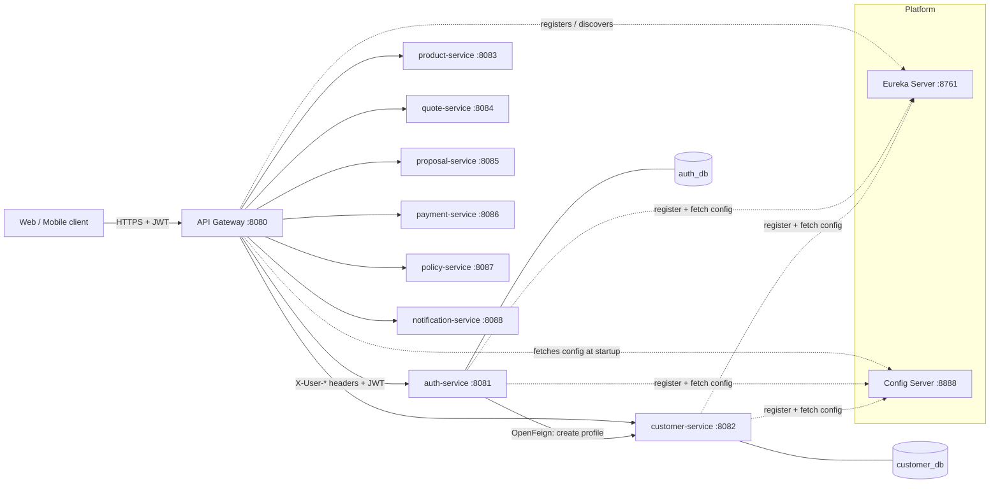

# Insurance E-commerce Platform (Spring Boot Microservices)

A production-style insurance e-commerce platform built incrementally for learning, portfolio and
interview preparation. Customers register, browse motor insurance products, get a quote, submit a
proposal, pay, and receive a policy which they can later renew.

> **Status: Phase 3B complete.** Phase 1 = platform (Eureka, Config Server, API Gateway).
> Phase 2 = `common-lib`, `auth-service`, `customer-service`. Phase 3A = `product-service` with Redis caching. Phase 3B = `quote-service` (premium engine, Feign + Resilience4j, expiry job).
> Next: 3C proposal, 3D payment, 3E policy, 3F claims, 3G document, 3H notification, 3I end-to-end.
> Design notes per service live in `docs/` (e.g. `docs/product-service-design.md`).

## 1. Project overview

| Item | Choice |
|---|---|
| Language / runtime | Java 17 |
| Framework | Spring Boot 3.5.x, Spring Cloud 2025.0.x |
| Build | Maven multi-module (`./mvnw`), one parent POM, independently buildable modules |
| Platform | Eureka (discovery), Config Server (centralised config), Spring Cloud Gateway (edge) |
| Data | MySQL, database per service, Flyway migrations, H2 (MySQL mode) for tests and the `h2` profile |
| Security | JWT (HS256 family) issued by auth-service, validated at the gateway AND in every service |
| Service-to-service | OpenFeign + Eureka, service JWT with pseudo role `SERVICE` |
| Observability | Actuator, correlation id in every log line (MDC), springdoc OpenAPI per service |

## 2. Architecture



**Startup order:** Eureka → Config Server → API Gateway → business services (config-first bootstrap:
every service knows the Config Server URL from an env var and pulls its configuration before it
registers with Eureka).

### Ports

| Service | Port | Phase | Database |
|---|---|---|---|
| eureka-server | 8761 | 1 | - |
| config-server | 8888 | 1 | - |
| api-gateway | 8080 | 1 | - |
| auth-service | 8081 | 2 | auth_db |
| customer-service | 8082 | 2 | customer_db |
| product-service | 8083 | 3 | product_db |
| quote-service | 8084 | 3 | quote_db |
| proposal-service | 8085 | 4 | proposal_db |
| payment-service | 8086 | 4 | payment_db |
| policy-service | 8087 | 4 | policy_db |
| notification-service | 8088 | 5 | notification_db |

## 3. Modules

### eureka-server (Phase 1)
Standalone registry. Services renew a lease every 10 s; leases not renewed for 30 s are evicted.
Dashboard: http://localhost:8761

### config-server (Phase 1)
Serves `config-server/src/main/resources/config/` (native backend) behind HTTP Basic:
`application.yml` (shared: Eureka, actuator, JPA defaults, JWT settings, logging pattern),
`application-h2.yml` (profile `h2`: run without MySQL), `<service>.yml` per service.
`curl -u config-user:config-pass http://localhost:8888/auth-service/default`

### api-gateway (Phase 1)
WebFlux gateway. Routes `/api/**` with `lb://<service>` through Eureka. Global filters: correlation id,
request logging, JWT validation (adds `X-User-Id`, `X-User-Email`, `X-User-Roles`, strips spoofed ones),
standard JSON errors for 401/404/503/504.

### common-lib (Phase 2) - the platform starter
A library, not a service. Auto-configured (`META-INF/spring/...AutoConfiguration.imports`) so services
do not component-scan it. It contains **no business logic and no entities**:

| Package | Contents |
|---|---|
| `dto` | `ApiErrorResponse` (same shape as the gateway), `FieldErrorDetail`, `PageResponse<T>` |
| `exception` | `BusinessException` base + `ResourceNotFound`, `DuplicateResource`, `Validation`, `Forbidden`, `ServiceUnavailable`, `Payment`, `QuoteExpired`, `Policy`; `GlobalExceptionHandler` (`@RestControllerAdvice`) |
| `security` | `JwtProperties`, `JwtTokenVerifier`, `JwtAuthenticationFilter`, `AuthenticatedUser` principal, JSON 401/403 handlers, default stateless `SecurityFilterChain`, `@EnableMethodSecurity`, `PasswordEncoder` |
| `jpa` | `AuditableEntity` (`created_at/by`, `updated_at/by`, `@Version`) + JPA auditing wired to the JWT user |
| `web` | `CorrelationIdFilter` (MDC), OpenAPI bearer-auth defaults |

Decision: a shared library vs. copy-paste per service. Copying keeps services fully independent but the
error format and security rules drift within weeks. A thin, versioned library with zero domain code is
the usual compromise; if it ever grows business logic, that is the signal to split it.

### product-service (Phase 3A)
Catalogue aggregate: product + coverages + add-ons + eligibility rules + pricing configuration, seeded with
two motor products (`MOTOR-CAR-COMP`, `MOTOR-BIKE-TP`). Public browsing with filters/pagination, admin CRUD
(DELETE = deactivate, code immutable, children merged in place), eligibility evaluation for quote-service,
pricing endpoint for ADMIN/AGENT/SERVICE. Redis caches product details, catalogue pages and pricing with
per-cache TTLs and explicit eviction on every write; a Redis outage degrades to database reads.
See `docs/product-service-design.md`.

### quote-service (Phase 3B)
Prices a customer + vehicle + product + add-ons selection with a pure premium engine (rates from
product-service, vehicle from customer-service via Feign with SERVICE tokens), stores a full snapshot,
manages GENERATED -> ACCEPTED / EXPIRED / CANCELLED, expires overdue quotes with a cron job, caches quote
lookups in Redis and publishes a QuoteGenerated event (in-process today). Resilience4j circuit breaker +
retry on each downstream with a 503 fallback. See `docs/quote-service-design.md`.

### auth-service (Phase 2)
Registration, login, JWT issuing, refresh-token rotation, roles (`CUSTOMER`, `ADMIN`, `AGENT`), admin user
search. Owns `auth_db` (`users`, `user_roles`, `refresh_tokens`). On registration it calls customer-service
through OpenFeign to create the profile. Bootstraps the first ADMIN from `ADMIN_EMAIL`/`ADMIN_PASSWORD`.

### customer-service (Phase 2)
Customer profile, address (embedded value object), KYC workflow (`PENDING → VERIFIED | REJECTED`) and
vehicles. Owns `customer_db` (`customers`, `vehicles`). Ownership rule in `CustomerAccessPolicy`:
a customer sees only their own data; ADMIN/AGENT see everyone; SERVICE (other microservices) may read.

## 4. Database architecture

Database-per-service: each service owns its schema, migrates it with Flyway and is the only writer.
No foreign keys cross a service boundary (`customers.user_id` references `auth_db.users.id` only
logically). Every table carries `created_at, created_by, updated_at, updated_by, version`.

```text
auth_db                          customer_db
  users (uk email)                 customers (uk user_id, uk email, idx last_name, idx kyc_status)
  user_roles (pk user_id+role)     vehicles  (uk registration_number, idx customer_id, fk customer)
  refresh_tokens (uk token_hash, idx user_id, fk user)
```

Flyway scripts: `auth-service/src/main/resources/db/migration/V1__create_auth_tables.sql`,
`customer-service/src/main/resources/db/migration/V1__create_customer_tables.sql`.
Hibernate runs with `ddl-auto: validate`: the schema comes from Flyway, Hibernate only checks the mapping.
Timestamps are stored as `DATETIME(6)` in UTC (`hibernate.timezone.default_storage=NORMALIZE_UTC`) so the
same scripts run on MySQL and on H2 in MySQL mode.

## 5. API list

```text
Public (no token)
POST /api/auth/register                       create account + customer profile
POST /api/auth/login                          -> accessToken (15 min), refreshToken (7 days)
POST /api/auth/refresh                        rotate refresh token, new pair
GET  /api/products?type=&vehicleType=&coverageType=&page=&size=&sort=   catalogue (active only)
GET  /api/products/{id}                       coverages, add-ons, rules

Any authenticated user
POST /api/auth/logout                         revoke a refresh token
GET  /api/auth/me                             my account
GET  /api/customers/{id}                      owner, ADMIN, AGENT, SERVICE
GET  /api/customers/{id}/vehicles             owner, ADMIN, AGENT, SERVICE (paged)
GET  /api/customers/{id}/vehicles/{vehicleId} owner, ADMIN, AGENT, SERVICE

CUSTOMER
GET  /api/customers/me                        my profile
PUT  /api/customers/me                        name, phone, date of birth, gender, address
PUT  /api/customers/me/kyc                    submit KYC document (status -> PENDING)
POST /api/customers/me/vehicles               add vehicle
GET  /api/customers/me/vehicles?page=&size=&sort=
PUT  /api/customers/me/vehicles/{vehicleId}
DELETE /api/customers/me/vehicles/{vehicleId}

CUSTOMER / AGENT / ADMIN (own quotes; AGENT/ADMIN any customer)
POST /api/quotes/preview                      price without saving
POST /api/quotes                              generate quote (201)
GET  /api/quotes/{quoteNumber}                owner, ADMIN, AGENT, SERVICE
GET  /api/quotes?status=&productId=&customerId=&page=&size=&sort=
POST /api/quotes/{quoteNumber}/accept
POST /api/quotes/{quoteNumber}/cancel

ADMIN / AGENT / SERVICE
GET  /api/products/{id}/pricing               pricing parameters (quote engine input)
POST /api/products/{id}/eligibility-check     any authenticated caller

ADMIN / AGENT
GET  /api/customers?name=&email=&kycStatus=&page=0&size=20&sort=createdAt,desc
PATCH /api/customers/{id}/kyc                 {"decision":"VERIFIED"|"REJECTED"}
GET  /api/customers/by-user/{userId}          (also SERVICE)

ADMIN
POST /api/products                            create aggregate
PUT  /api/products/{id}                       replace aggregate
DELETE /api/products/{id}                     deactivate (soft delete)
PATCH /api/products/{id}/activate
GET  /api/auth/users?email=&page=&size=&sort=
GET  /api/auth/users/{id}
PUT  /api/auth/users/{id}/roles               {"roles":["CUSTOMER","AGENT"]}

SERVICE (auth-service -> customer-service, not exposed to end users)
POST /api/customers                           idempotent per userId
```

Swagger UI per service: http://localhost:8081/swagger-ui.html, http://localhost:8082/swagger-ui.html
(use the Authorize button with a token from `/api/auth/login`).

## 6. Business flow
Register -> Login -> Complete profile + KYC -> Add vehicle -> *(Phase 3)* Browse products -> Quote ->
*(Phase 4)* Proposal -> Payment -> Policy -> Renew.

## 7. Authentication flow

```text
1. POST /api/auth/register / login  ->  auth-service verifies password (BCrypt), signs JWT
        claims: iss=insurance-platform, sub=<user id>, email, roles=[...], iat, exp (15 min)
        plus an opaque refresh token (random 256 bit, stored as SHA-256 hash, 7 days)
2. Client sends  Authorization: Bearer <jwt>
3. API Gateway validates signature/expiry; public path? forward : 401 JSON.
   Adds X-User-Id / X-User-Email / X-User-Roles after stripping any client-sent copies.
4. Service (common-lib JwtAuthenticationFilter) validates the JWT AGAIN (defence in depth), builds the
   SecurityContext with ROLE_* authorities -> @PreAuthorize("hasRole('ADMIN')") works.
5. Ownership checks (own profile / own vehicles) happen in the service layer (CustomerAccessPolicy).
6. Refresh: POST /api/auth/refresh rotates the token; presenting an already-rotated token revokes
   every session of that user (theft detection). Logout revokes one refresh token.
```

**Service-to-service auth.** auth-service calls `POST /api/customers` directly (Eureka, not through
the gateway) with a self-issued JWT: `sub=0`, `roles=[SERVICE]`, 5 min lifetime, cached and renewed by
`ServiceTokenProvider`; a Feign `RequestInterceptor` adds it and the correlation id to every call.

**Registration consistency (no distributed transaction).** The user insert and the Feign call run in one
local transaction: if customer-service fails, the insert rolls back (no login without profile). If our
commit fails after the profile exists, the next attempt reuses it because profile creation is idempotent
per `userId`. Alternatives: outbox + event (Phase 5 discusses), or saga with compensation.

## 8. Quote flow

```text
POST /api/quotes {productId, vehicleId, addOnCodes, ncbPercent}
  -> customer-service: profile by user id (driver age from date of birth), vehicle by id (IDV = current value)
  -> product-service: product (add-on catalogue, active?), eligibility-check (all violations), pricing
  -> PremiumCalculator: base + add-ons - discount + tax = final (see docs/quote-service-design.md)
  -> quote_db snapshot, status GENERATED, validUntil = now + 15 days, QuoteGenerated event
POST /api/quotes/{n}/accept   -> ACCEPTED (422 QUOTE_EXPIRED if overdue)   -> proposal (Phase 3C)
cron every 10 min             -> GENERATED past validUntil -> EXPIRED
```

## 9-10. Payment / Policy issuance flows *(Phase 3D-3E)*

## 11. Redis usage

product-service caches with Spring Cache + Redis (typed JSON values, `cache-name::key`):

| Cache | Key | TTL | Evicted by |
|---|---|---|---|
| `products` | product id | 1 h | update / (de)activate of that id |
| `product-catalog` | filters + page + size + sort | 10 min | any product write (all entries) |
| `product-pricing` | product id | 1 h | update of that id |

Why Redis and not an in-process cache: several instances must agree after an admin edit; a shared cache with
explicit eviction guarantees that, TTL is the fallback. Not cached: eligibility checks (input specific) and
writes. A `CacheErrorHandler` logs cache failures and falls through to MySQL, so Redis being down slows the
catalogue instead of breaking it. Quote lookups will be cached in quote-service (Phase 3B).

## 12. Pagination, sorting and filtering

Every list endpoint takes Spring Data's `Pageable` (`page`, `size`, `sort=field,direction`) and returns
`PageResponse` (`content, page, size, totalElements, totalPages, last`), never the raw `Page` JSON.
`spring.data.web.pageable.max-page-size=100` caps abusive sizes. Filtering uses a JPA `Specification`
(`CustomerSpecifications.withFilters`) that adds only the predicates actually supplied, backed by indexes
on `last_name` and `kyc_status`.

## 13. Scheduler

`QuoteExpiryScheduler`: `quote.expiry.cron` (default `0 */10 * * * *`, `-` disables) runs one set-based
UPDATE for overdue GENERATED quotes and clears the quote cache. Policy expiry and renewal reminders follow in 3E.

## 14. Resilience4j

quote-service wraps each downstream (product-service, customer-service) in a circuit breaker (10-call
window, opens at 50% failures, 20 s open, 3 half-open trials) and a retry (3 attempts, exponential backoff)
for idempotent reads; Feign timeouts bound each attempt. Business errors (404/422) are not counted as
failures. The fallback raises `503 SERVICE_UNAVAILABLE` naming the dependency instead of inventing data.
auth-service still calls customer-service without a breaker (single call at registration).

## 15. Docker setup

`docker-compose.yml` runs Eureka, Config Server, Gateway, MySQL 8.4 (one database per service created by
`docker/mysql/init.sql`), auth-service and customer-service. **Not verified on this machine** (no Docker).

```bash
cp .env.example .env            # set JWT_SECRET, MySQL passwords, ADMIN_PASSWORD
docker compose up --build
```

## 16. Testing

| Module | Tests | What they prove |
|---|---|---|
| eureka-server | 2 | boots, health, registry endpoint |
| config-server | 3 | serves merged config with basic auth, anonymous 401, public health |
| api-gateway | 24 | JWT validation, public paths, header spoofing, 401/404/503 JSON, correlation id (real Netty boot) |
| common-lib | 10 | exception handler mapping (standalone MockMvc), JWT verifier (expiry, issuer, signature) |
| auth-service | 20 | unit: register/login rules, refresh rotation + reuse detection, token round-trip; IT on H2 + Flyway: full session lifecycle, 409, 400 with field errors, 401, ADMIN vs CUSTOMER, role assignment; `AuthFlywayMySqlIT` on real MySQL via Testcontainers (auto-skipped without Docker) |
| customer-service | 17 | unit: idempotent create, ownership, age and vehicle rules; IT: SERVICE-only create, profile + KYC flow, 403 for other customers, admin search with filters/pagination, vehicle lifecycle incl. duplicate and eligibility rules |
| quote-service | 17 | unit: premium engine to the paisa (loadings, caps, add-on types, EV/NCB discounts, third-party only), service rules (ineligible, unknown add-on, agent-only customerId, driver age, expired/foreign accept); IT with mocked Feign clients: breakdown, preview not persisted, ownership/roles/listing, accept/cancel/expiry job, 422/400/404 mapping, product outage -> 503 via circuit breaker fallback |
| product-service | 18 | unit: eligibility evaluator (all violations, fuel list, effective dates), aggregate validation; IT: seeded catalogue public with filters, pricing 401/403/200 by role, eligibility, admin lifecycle (409, immutable code, in-place child merge, deactivate hides from catalogue), field errors; caching contract (hit/evict) with in-memory cache; `ProductRedisCacheIT` on real Redis via Testcontainers (skipped without Docker) |

`./mvnw test` runs everything (surefire includes `*IT` classes; they use H2 so no infrastructure is needed).

## 17. How to run locally

**Option A - no MySQL (profile `h2`, file database under `./data/`):**

```bash
./mvnw clean package -DskipTests
java -jar eureka-server/target/eureka-server-1.0.0-SNAPSHOT.jar
java -jar config-server/target/config-server-1.0.0-SNAPSHOT.jar
java -jar api-gateway/target/api-gateway-1.0.0-SNAPSHOT.jar
SPRING_PROFILES_ACTIVE=h2 ADMIN_PASSWORD=Admin12345 java -jar auth-service/target/auth-service-1.0.0-SNAPSHOT.jar
SPRING_PROFILES_ACTIVE=h2 java -jar customer-service/target/customer-service-1.0.0-SNAPSHOT.jar
SPRING_PROFILES_ACTIVE=h2 java -jar product-service/target/product-service-1.0.0-SNAPSHOT.jar   # works without Redis (cache misses are logged)
SPRING_PROFILES_ACTIVE=h2 java -jar quote-service/target/quote-service-1.0.0-SNAPSHOT.jar
```

Services register in Eureka as `localhost` by default (laptops have several adapters and changing IPs);
docker-compose sets `EUREKA_PREFER_IP=true` so containers register their container IP.

**Option B - local MySQL:** run without the profile and pass credentials:
`MYSQL_USER=... MYSQL_PASSWORD=... java -jar auth-service/...` (databases are created automatically via
`createDatabaseIfNotExist=true`, so the user needs CREATE privilege or pre-created `auth_db`/`customer_db`).

PowerShell: `$env:SPRING_PROFILES_ACTIVE="h2"; java -jar ...`. If port 8080 is busy: `SERVER_PORT=8090`.
Set `JWT_SECRET` (same value for gateway and services) for anything beyond a laptop.

## 18. Example API requests (verified end to end through the gateway)

```bash
curl -X POST localhost:8080/api/auth/register -H "Content-Type: application/json" \
  -d '{"email":"jane@example.com","password":"Passw0rd1","firstName":"Jane","lastName":"Doe","phone":"9876543210"}'
# 201 {"accessToken":"eyJ...","refreshToken":"...","tokenType":"Bearer","expiresInSeconds":900,"user":{...}}

curl -X POST localhost:8080/api/auth/login -H "Content-Type: application/json" \
  -d '{"email":"jane@example.com","password":"Passw0rd1"}'

curl localhost:8080/api/customers/me -H "Authorization: Bearer $TOKEN"
# 200 {"id":1,"userId":2,"email":"jane@example.com","kycStatus":"PENDING",...}

curl -X POST localhost:8080/api/customers/me/vehicles -H "Authorization: Bearer $TOKEN" -H "Content-Type: application/json" \
  -d '{"registrationNumber":"MH 12 AB 1234","vehicleType":"CAR","make":"Honda","model":"City","fuelType":"PETROL",
       "manufacturingYear":2022,"engineCapacityCc":1498,"registrationDate":"2022-06-01","currentValue":650000}'
# 201 {"registrationNumber":"MH12AB1234", ...}          (normalised, unique platform-wide)

curl "localhost:8080/api/customers?name=jane" -H "Authorization: Bearer $TOKEN"
# 403 {"error":"FORBIDDEN"}   -> customers cannot search; login as admin@insurance.local for 200 + PageResponse

curl -X POST localhost:8080/api/auth/register ... (same email)
# 409 {"status":409,"error":"DUPLICATE_RESOURCE","message":"An account with this email already exists","path":"/api/auth/register"}
```

Error body everywhere (gateway and services): `{"timestamp","status","error","message","path","fieldErrors?"}`.

## 19. Interview notes (Phase 2 additions)

- **Auto-configuration vs component scan** for a shared library: `AutoConfiguration.imports` + `@ConditionalOnMissingBean` lets any service override a default bean.
- **BCrypt** is deliberately slow (work factor); passwords are never logged or returned (`UserResponse` has no hash).
- **Refresh-token rotation** and **hash-at-rest**: a stolen refresh token works once; a leaked DB cannot mint sessions.
- **`@Transactional` boundaries**: service methods, `readOnly=true` for queries; a remote call inside the transaction is a conscious trade-off (documented in `AuthService`).
- **Optimistic locking**: `@Version` on every entity; concurrent edits fail with 409 `CONCURRENT_MODIFICATION`.
- **Specifications** vs derived queries for optional filters; indexes chosen from the actual WHERE clauses.
- **MapStruct** generates mappers at compile time: no reflection, compile errors when fields drift.
- **Testcontainers** proves the MySQL path; H2 keeps the default test run infrastructure-free.

## 20. Future improvements
Kafka events, RS256/JWKS, Redis rate limiting and caching, Resilience4j, Micrometer tracing, Spring Cloud Bus.
